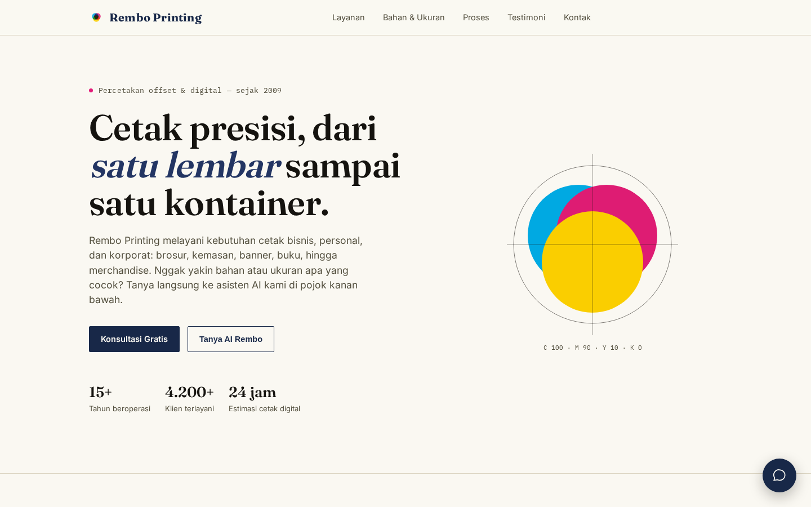

# Rembo Printing — Landing Site

Marketing site for a commercial printing business: service catalogue, material and size reference, process steps, testimonials, and a contact flow. Delivered as a single self-contained HTML file — the client can host it anywhere with no build step and no server.



**Live demo:** https://padit8035-glitch.github.io/Rembo-Printing-web-/

## Sections

| Anchor | Content |
| --- | --- |
| `#top` | Hero with the primary call to action |
| `#layanan` | Service catalogue |
| `#bahan-ukuran` | Material and size reference table |
| `#proses` | Four-step process: design to delivery |
| `#testimoni` | Customer testimonials |
| — | Closing CTA and footer contact |

## Build

Zero dependencies, zero build. Typography and layout live in one `<style>` block using CSS custom properties for the colour system; a print stylesheet keeps the material reference readable on paper.

## Run

```bash
python3 -m http.server 8000   # then open http://localhost:8000
```

Opening `index.html` directly works too, since there is no module or fetch usage.

## Notes

- Fully responsive, Indonesian copy.
- Business name, address, and contact details are sample data for the portfolio piece.

MIT licensed.
